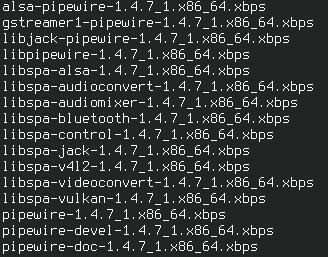
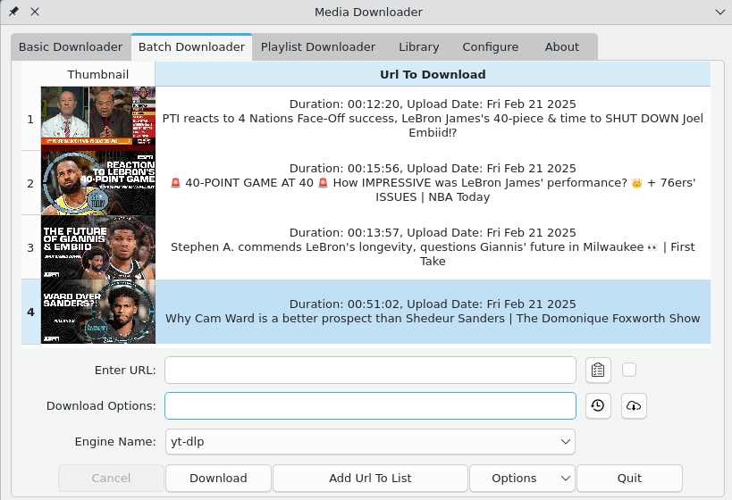
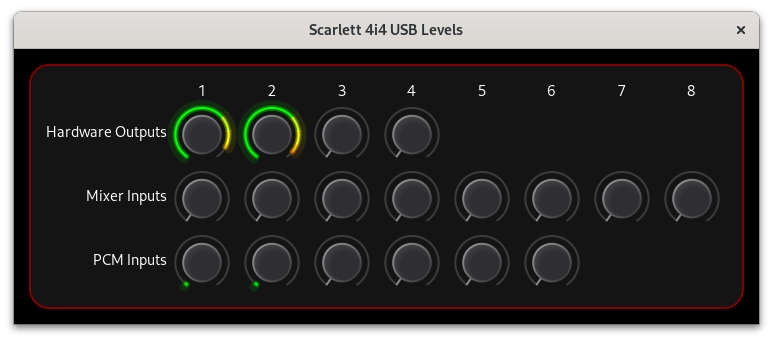
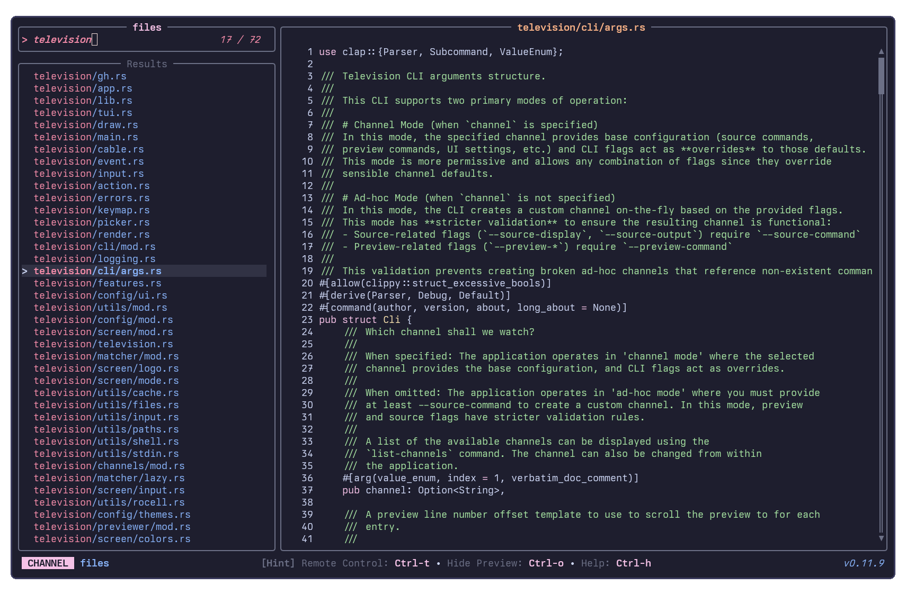
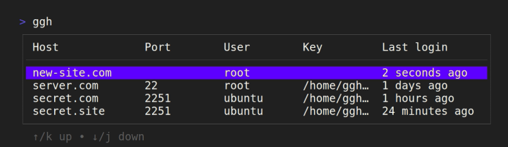
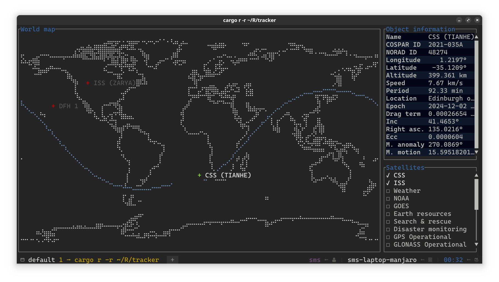
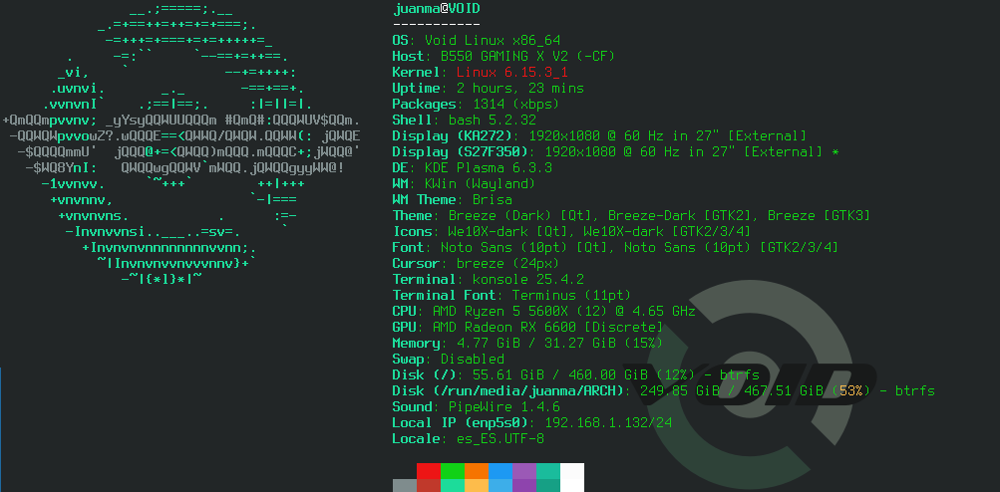

The main objective of this repository is to publish **VOIDLINUX** packages using my personal repo that can be added to your system or explore it using your web browser , also publish xsrc templates as well as other scripts.

[VoidLinux](https://voidlinux.org/).

* * *
* * *
## big news !

I get my own domain and get SSL certificate for the repo.

<span id="span1" >July 2025</span>

* * *
* * * 
# VOIDLINUX PERSONAL REPO

If you want to add this repo to your system do the following

```
# echo 'repository=https://voidrepo.linuxnauta.com' > /etc/xbps.d/jmboris.conf
xbps-install -S <pkg_name>
```

Otherwise you can explore the repo [https://voidrepo.linuxnauta.com](https://voidrepo.linuxnauta.com/) and download and install the package mannually.

If you prefer to download the templates and compile yourself the files you can check the links below

<span id="span1" >January 2025</span>

* * *
* * *

# XSRC TEMPLATES

* * *


## PipeWire 1.4.7

PipeWire 1.4.7 , template for VoidLinux



[Github REPO](https://github.com/jmboris/Pipewire)


Explore realeses

[https://voidrepo.linuxnauta.com](https://voidrepo.linuxnauta.com/)  |  Binaries repo


[!NOTE]
To compile pipewire you need some soft links in the srcpkgs folder pointing to pipewirefolder

```
srcpkgs
├── alsa-pipewire -> pipewire/
├── gstreamer1-pipewire -> pipewire/
├── libjack-pipewire -> pipewire
├── libpipewire -> pipewire
├── libspa-alsa -> pipewire
├── libspa-audioconvert -> pipewire
├── libspa-audiomixer -> pipewire
├── libspa-bluetooth -> pipewire
├── libspa-control -> pipewire
├── libspa-jack -> pipewire
├── libspa-v4l2 -> pipewire
├── libspa-videoconvert -> pipewire
├── libspa-vulkan -> pipewire
├── pipewire
│   ├── INSTALL.msg
│   ├── files
│   │   ├── 20-pipewire-pulse.conf
│   │   ├── README.voidlinux
│   │   ├── pipewire
│   │   │   ├── control
│   │   │   │   └── t
│   │   │   └── run
│   │   ├── pipewire-pulse.desktop
│   │   └── pipewire.desktop
│   ├── patches
│   │   └── fix-neon-detection.patch
│   └── template
├── pipewire-devel -> pipewire
├── pipewire-doc -> pipewire

```

<span id="span1" >June 2025</span>

* * *


## media-downloader

version 5.4.1

Media Downloader is a Qt/C++ front end to yt-dlp, youtube-dl, gallery-dl, lux, you-get, svtplay-dl, aria2c, wget and safari books..



[Github REPO](https://github.com/jmboris/media-downloader)

[https://voidrepo.linuxnauta.com](https://voidrepo.linuxnauta.com/)  |  Binaries repo

Developer
[https://github.com/mhogomchungu/media-downloader](https://github.com/mhogomchungu/media-downloader)

<span id="span1" >July 2025</span>

* * *

## alsa-scarlett-gui

version 0.5.1

alsa-scarlett-gui is a Gtk4 GUI for the ALSA controls presented by the Linux kernel Focusrite USB Drivers..



[Github REPO](https://github.com/jmboris/alsa-scarlett-gui)

[https://voidrepo.linuxnauta.com](https://voidrepo.linuxnauta.com/)  |  Binaries repo

Developer
[https://github.com/geoffreybennett/alsa-scarlett-gui](https://github.com/geoffreybennett/alsa-scarlett-gui)

<span id="span1" >July 2025</span>

* * *


## television 

television 0.12.5 A cross-platform, fast and extensible general purpose fuzzy finder



[Github REPO](https://github.com/jmboris/television)

[https://voidrepo.linuxnauta.com](https://voidrepo.linuxnauta.com/)  |  Binaries repo

Developer
[https://github.com/alexpasmantier/television](https://github.com/alexpasmantier/television)

<span id="span1" >July 2025</span>

* * *

## ggh 

ggh 0.1.4 , template for VoidLinux

Recall your SSH sessions (also search your SSH config file)



[Github REPO](https://github.com/jmboris/voidlinux-ggh-template)

[https://voidrepo.linuxnauta.com](https://voidrepo.linuxnauta.com/)  |  Binaries repo

Developer
[https://github.com/byawitz/ggh](https://github.com/byawitz/ggh)

<span id="span1" >July 2025</span>

* * *

## tracker

tracker 0.1.4 , template for VoidLinux

Terminal-based real-time satellite tracking and orbit prediction



[Github REPO](https://github.com/jmboris/voidlinux-tracker-template)

[https://voidrepo.linuxnauta.com](https://voidrepo.linuxnauta.com/)  |  Binaries repo

Developer 
[https://github.com/ShenMian/tracker/](https://github.com/ShenMian/tracker)


<span id="span1" >July 2025</span>

* * *

## git 2.50.1 

Voidlinux git 2.50.1 - binary xbps

[https://voidrepo.linuxnauta.com](https://voidrepo.linuxnauta.com/)  |  Binaries repo


<span id="span1" >July 2025</span>

* * *

## PipeWire 1.4.6

PipeWire 1.4.6 , template for VoidLinux

[Github REPO](https://github.com/jmboris/Pipewire)

Explore realeses

[https://voidrepo.linuxnauta.com](https://voidrepo.linuxnauta.com/)  |  Binaries repo

<span id="span1" >June 2025</span>

* * *

## Voidlinux dysk template

Latest version 2.10.1

Template for VoidLinux to install dysk

A linux utility to get information on filesystems, like df but better


[REPO](https://github.com/jmboris/Voidlinux-dysk)

[https://voidrepo.linuxnauta.com](https://voidrepo.linuxnauta.com/)  |  Binaries repo

Developer:
[https://github.com/Canop/dysk?tab=readme-ov-file](https://github.com/Canop/dysk?tab=readme-ov-file)

<span id="span1" >June 2025</span>

* * *

## Voidlinux sirikali templates

Latest version 1.8.2

Template for VoidLinux to install sirikali

SiriKali is a Qt/C++ GUI application that manages ecryptfs, cryfs, encfs, gocryptfs, fscrypt and securefs based encrypted folders. SiriKali can also connect to ssh servers using sshf

[REPO](https://github.com/jmboris/Voidlinux-sirikali-templates)

Developer 
[https://mhogomchungu.github.io/sirikali/](https://mhogomchungu.github.io/sirikali/)

[https://voidrepo.linuxnauta.com](https://voidrepo.linuxnauta.com/)  |  Binaries repo

<span id="span1" >February 2025</span>

* * *

## voidlinux kernel zen-6.13

Kernel 6.13 with patch zen , template for VoidLinux

[REPO](https://github.com/jmboris/voidlinux-kernel-zen-6.13)

[https://voidrepo.linuxnauta.com](https://voidrepo.linuxnauta.com/)  |  Binaries repo

<span id="span1" >January 2025</span>

* * *

## voidlinux kernel zen-6.12.8

Kernel 6.12.8 with patch zen , template for VoidLinux

[REPO](https://github.com/jmboris/voidlinux-kernel-zen-6.12.8)

[https://voidrepo.linuxnauta.com](https://voidrepo.linuxnauta.com/)  |  Binaries repo

<span id="span1" >January 2025</span>

* * *

## voidlinux kernel zen-6.12.6 

Kernel 6.12.6 with patch zen , template for VoidLinux

[REPO](https://github.com/jmboris/voidlinux-kernel-zen-6.12.6)

[https://voidrepo.linuxnauta.com](https://voidrepo.linuxnauta.com/)  |  Binaries repo

<span id="span1" >January 2025</span>

* * *


## fastfetch

fastfetch config file for Void Linux



[REPO](https://github.com/jmboris/fastfetch)

<span id="span1" >December 2024</span>


* * *

```
This is the end.
```
